# 📐 Diagramas C4 - Plataforma RWA

Diagramas de arquitectura siguiendo el modelo C4 (Context, Containers, Components, Code)

---

## 📊 Nivel 1: Diagrama de Contexto (System Context)

Muestra el sistema RWA y sus usuarios/sistemas externos.

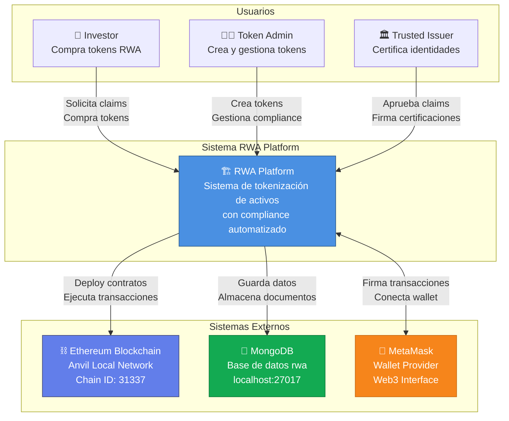

---

## 🏗️ Nivel 2: Diagrama de Contenedores (Container Diagram)

Muestra las aplicaciones que componen el sistema RWA.

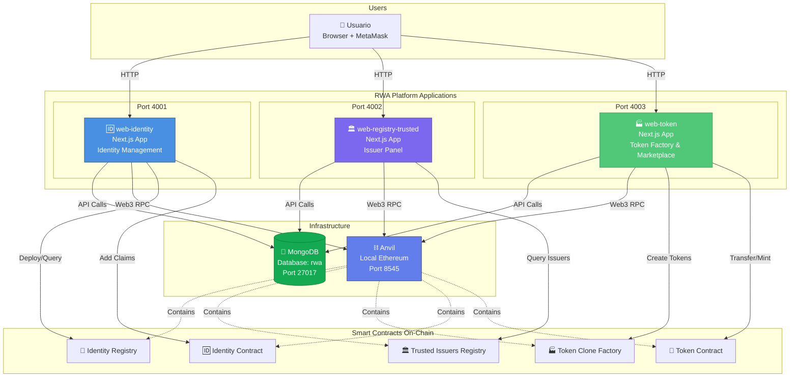

---

## 🔧 Nivel 3: Diagrama de Componentes (Component Diagram)

### web-identity (Port 4001)

```mermaid
graph TB
    subgraph "web-identity Application"
        subgraph "Pages"
            IndexPage[📄 page.tsx<br/>Main Dashboard]
        end
        
        subgraph "Components"
            ClaimRequestForm[📝 ClaimRequestForm<br/>Solicitar claims]
            ClaimRequestsList[📋 ClaimRequestsList<br/>Ver mis requests]
            RequestDetailModal[🔍 RequestDetailModal<br/>Ver detalles + Cargar claim]
        end
        
        subgraph "API Routes"
            ClaimRequestsAPI[🔌 /api/claim-requests<br/>CRUD requests]
            UploadAPI[📤 /api/upload<br/>Subir a GridFS]
            DownloadAPI[📥 /api/download/[id]<br/>Descargar de GridFS]
        end
        
        subgraph "Libraries"
            MongoLib[💾 lib/mongodb.ts<br/>Conexión MongoDB]
            ContractsLib[📜 lib/contracts.ts<br/>ABIs y addresses]
            ClaimsLib[⚖️ lib/identity-claims.ts<br/>Funciones de claims]
        end
        
        subgraph "External"
            MongoDB[(MongoDB<br/>claim_requests<br/>GridFS)]
            Blockchain[⛓️ Blockchain<br/>Identity Contracts]
        end
    end
    
    IndexPage --> ClaimRequestForm
    IndexPage --> ClaimRequestsList
    
    ClaimRequestForm -->|Submit request| ClaimRequestsAPI
    ClaimRequestForm -->|Upload file| UploadAPI
    ClaimRequestForm -->|Sign message| ContractsLib
    
    ClaimRequestsList -->|Fetch requests| ClaimRequestsAPI
    ClaimRequestsList -->|Open modal| RequestDetailModal
    
    RequestDetailModal -->|Download file| DownloadAPI
    RequestDetailModal -->|Add claim| ClaimsLib
    
    ClaimRequestsAPI --> MongoLib
    UploadAPI --> MongoLib
    DownloadAPI --> MongoLib
    
    MongoLib --> MongoDB
    ClaimsLib --> Blockchain
    ContractsLib --> Blockchain
    
    style IndexPage fill:#4A90E2,color:#fff
    style ClaimRequestForm fill:#5DADE2,color:#fff
    style ClaimRequestsList fill:#5DADE2,color:#fff
    style RequestDetailModal fill:#5DADE2,color:#fff
```

### web-registry-trusted (Port 4002)

```mermaid
graph TB
    subgraph "web-registry-trusted Application"
        subgraph "Pages"
            RegistryPage[📄 page.tsx<br/>Registry Dashboard + Issuer Panel]
        end
        
        subgraph "Components"
            IssuerRequestsList[📋 IssuerRequestsList<br/>Ver pending requests]
            RequestDetailModal2[🔍 RequestDetailModal<br/>Aprobar/Rechazar + Firma]
        end
        
        subgraph "API Routes"
            IssuerRequestsAPI[🔌 /api/issuer-requests<br/>Get requests for issuer]
            UpdateRequestAPI[✅ /api/update-request<br/>Approve/Reject + Signature]
            DownloadAPI2[📥 /api/download/[id]<br/>Descargar documentos]
        end
        
        subgraph "Libraries"
            MongoLib2[💾 lib/mongodb.ts<br/>Conexión MongoDB]
            ContractsLib2[📜 contracts/TrustedIssuersRegistry.ts<br/>ABI y funciones]
        end
        
        subgraph "External"
            MongoDB2[(MongoDB<br/>claim_requests)]
            Blockchain2[⛓️ Blockchain<br/>Trusted Issuers Registry]
        end
    end
    
    RegistryPage -->|Query issuers| ContractsLib2
    RegistryPage -->|If is issuer| IssuerRequestsList
    
    IssuerRequestsList -->|Fetch requests| IssuerRequestsAPI
    IssuerRequestsList -->|Open modal| RequestDetailModal2
    
    RequestDetailModal2 -->|Download doc| DownloadAPI2
    RequestDetailModal2 -->|Sign decision| ContractsLib2
    RequestDetailModal2 -->|Update status| UpdateRequestAPI
    
    IssuerRequestsAPI --> MongoLib2
    UpdateRequestAPI --> MongoLib2
    DownloadAPI2 --> MongoLib2
    
    MongoLib2 --> MongoDB2
    ContractsLib2 --> Blockchain2
    
    style RegistryPage fill:#7B68EE,color:#fff
    style IssuerRequestsList fill:#9370DB,color:#fff
    style RequestDetailModal2 fill:#9370DB,color:#fff
```

### web-token (Port 4003)

```mermaid
graph TB
    subgraph "web-token Application"
        subgraph "Pages"
            FactoryPage[📄 page.tsx<br/>Token Factory]
            MarketplacePage[🏪 marketplace/page.tsx<br/>Buy & Transfer]
        end
        
        subgraph "Components"
            CreateTokenForm[📝 CreateTokenForm<br/>Crear tokens]
            TokensList[📋 TokensList<br/>Ver y gestionar tokens]
        end
        
        subgraph "API Routes"
            TokensAPI[🔌 /api/tokens<br/>CRUD tokens]
            PriceAPI[💰 /api/tokens/[id]/price<br/>Update price]
            ModulesAPI[📦 /api/tokens/[id]/modules<br/>Manage compliance]
            ClaimsAPI[🏷️ /api/tokens/[id]/claims<br/>Manage claims]
        end
        
        subgraph "Libraries"
            MongoLib3[💾 lib/mongodb.ts]
            FactoryLib[🏭 lib/contracts/TokenCloneFactory.ts]
            CloneableLib[💎 lib/contracts/TokenCloneable.ts]
            ComplianceLib[🔒 lib/contracts/compliance.ts]
        end
        
        subgraph "External"
            MongoDB3[(MongoDB<br/>tokens)]
            Blockchain3[⛓️ Blockchain<br/>Token Contracts]
        end
    end
    
    FactoryPage --> CreateTokenForm
    FactoryPage --> TokensList
    
    MarketplacePage --> TokensList
    
    CreateTokenForm -->|Create token| TokensAPI
    CreateTokenForm -->|Deploy clone| FactoryLib
    
    TokensList -->|Update price| PriceAPI
    TokensList -->|Add/hide modules| ModulesAPI
    TokensList -->|Remove claims| ClaimsAPI
    TokensList -->|Buy/Transfer| CloneableLib
    
    TokensAPI --> MongoLib3
    PriceAPI --> MongoLib3
    ModulesAPI --> MongoLib3
    ClaimsAPI --> MongoLib3
    
    MongoLib3 --> MongoDB3
    FactoryLib --> Blockchain3
    CloneableLib --> Blockchain3
    ComplianceLib --> Blockchain3
    
    style FactoryPage fill:#50C878,color:#fff
    style MarketplacePage fill:#3CB371,color:#fff
    style CreateTokenForm fill:#90EE90,color:#000
    style TokensList fill:#90EE90,color:#000
```

---

## 🔄 Nivel 4: Diagrama de Flujo de Datos (Data Flow)

### Flujo Completo: Investor Compra Token

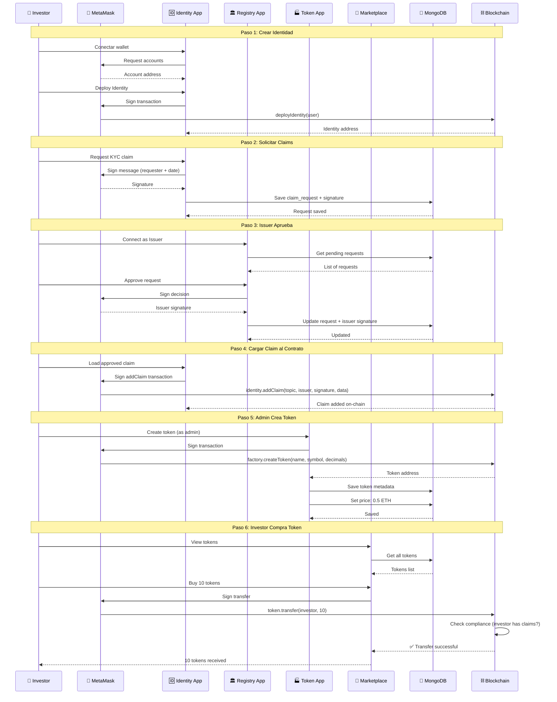

---

## 🔗 Diagrama de Integración de Smart Contracts

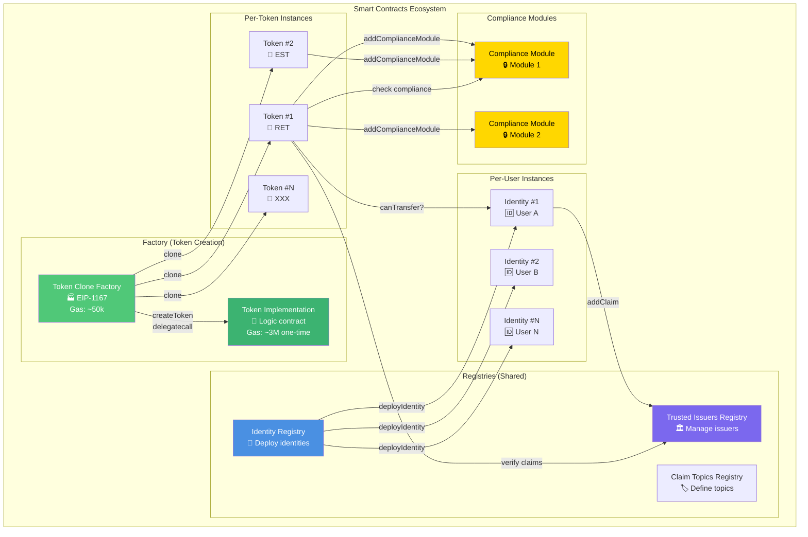

---

## 📦 Diagrama de Componentes - MongoDB Collections

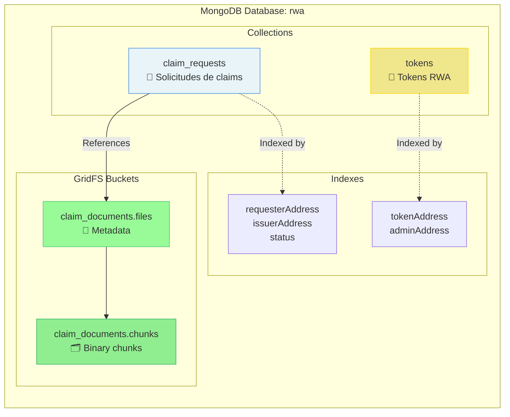

---

## 🔄 Diagrama de Estados: Claim Request Lifecycle

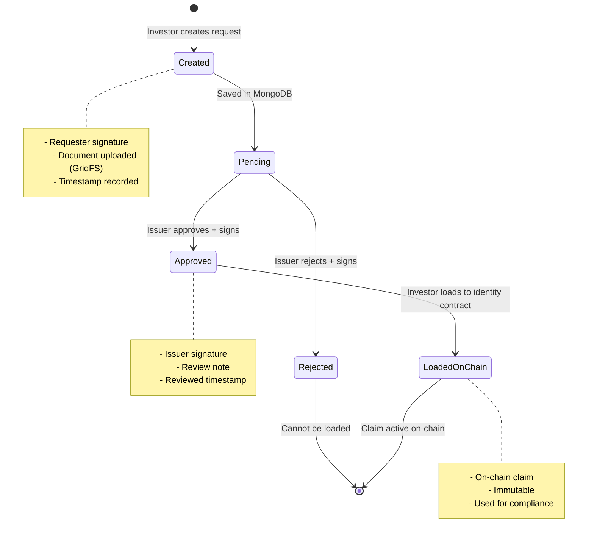

---

## 🛒 Diagrama de Flujo: Compra de Token

```mermaid
flowchart TD
    Start([👤 Investor ve Marketplace]) --> Connect{¿Wallet<br/>conectada?}
    
    Connect -->|No| ConnectWallet[🔗 Connect Wallet]
    ConnectWallet --> MetaMask1[🦊 MetaMask<br/>Solicita conexión]
    MetaMask1 --> Connected[✅ Conectado]
    
    Connect -->|Sí| Connected
    
    Connected --> ViewTokens[📋 Ver lista de tokens]
    ViewTokens --> SelectToken[💎 Seleccionar token]
    SelectToken --> CheckPrice{¿Precio<br/>establecido?}
    
    CheckPrice -->|No| ErrorNoPrice[❌ Error: Price not set]
    ErrorNoPrice --> End1([Fin])
    
    CheckPrice -->|Sí| ClickBuy[💰 Click Buy Tokens]
    ClickBuy --> EnterAmount[📝 Ingresar cantidad]
    EnterAmount --> Calculate[🧮 Calcular: cantidad × precio]
    Calculate --> SignTx[🦊 Firmar en MetaMask]
    
    SignTx --> EstimateGas[⛽ Estimar gas]
    EstimateGas --> ComplianceCheck{Compliance<br/>Check}
    
    ComplianceCheck -->|❌ No cumple| ErrorCompliance[🚫 Transfer not compliant]
    ErrorCompliance --> ShowRequirements[📋 Mostrar claims requeridos]
    ShowRequirements --> ShowGuide[💡 Guía: Ir a Identity app]
    ShowGuide --> End2([Fin])
    
    ComplianceCheck -->|✅ Cumple| ExecuteTx[⛓️ Ejecutar transfer()]
    ExecuteTx --> WaitConfirm[⏳ Esperar confirmación]
    WaitConfirm --> Success[✅ Tokens recibidos]
    Success --> ShowHash[📜 Mostrar hash]
    ShowHash --> End3([✅ Compra exitosa])
    
    style Start fill:#4A90E2,color:#fff
    style Success fill:#50C878,color:#fff
    style ErrorCompliance fill:#E74C3C,color:#fff
    style ErrorNoPrice fill:#E74C3C,color:#fff
```

---

## 🏗️ Arquitectura de Despliegue

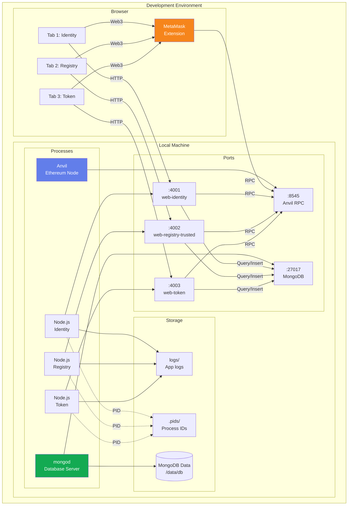

---

## 🔐 Diagrama de Seguridad: Sistema de Firmas

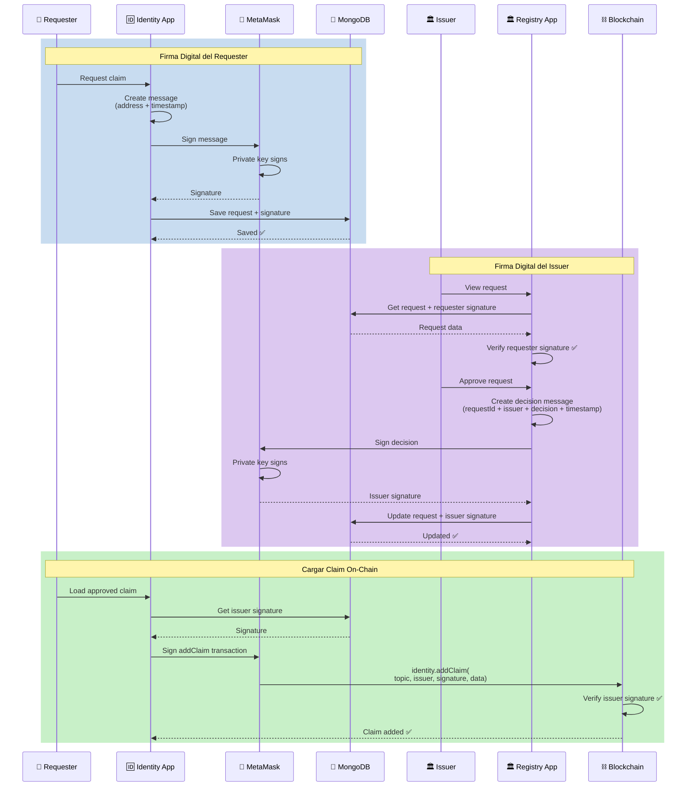

---

## 📊 Diagrama Entidad-Relación (MongoDB)

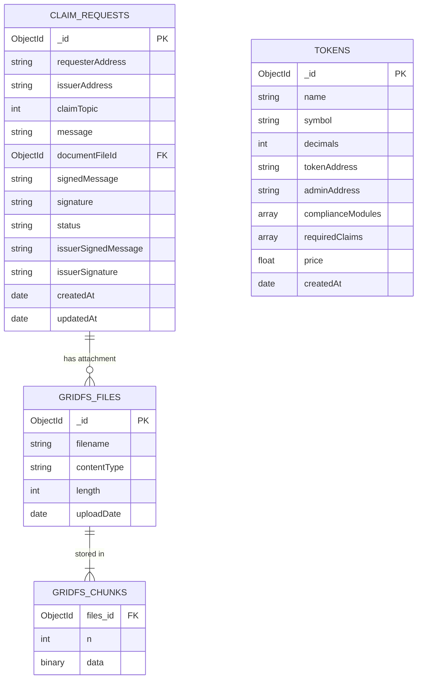

---

## 🎯 Diagrama de Decisión: Compliance Check

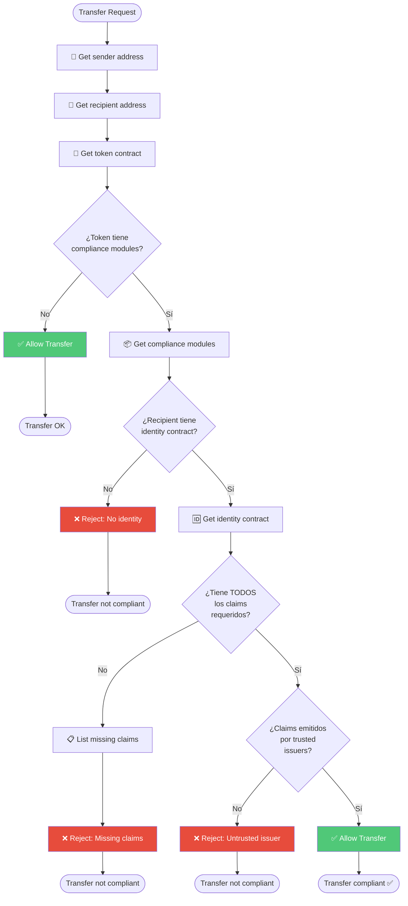

---

## 🔄 Diagrama de Ciclo de Vida: Token RWA

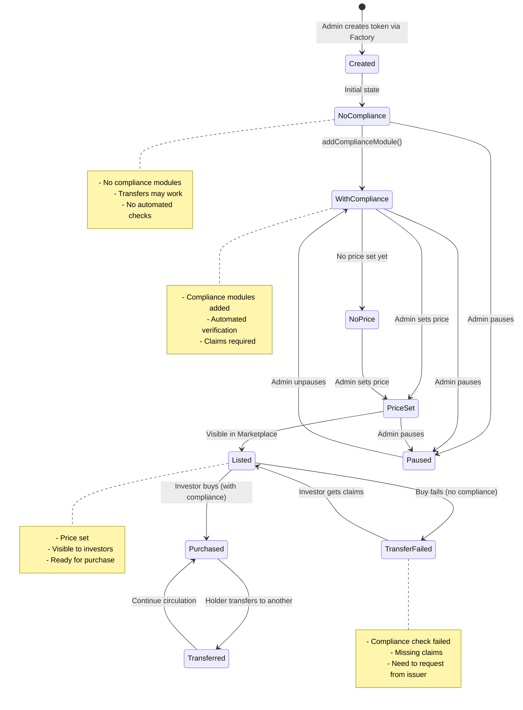

---

## 🌐 Diagrama de Red: Comunicación entre Componentes

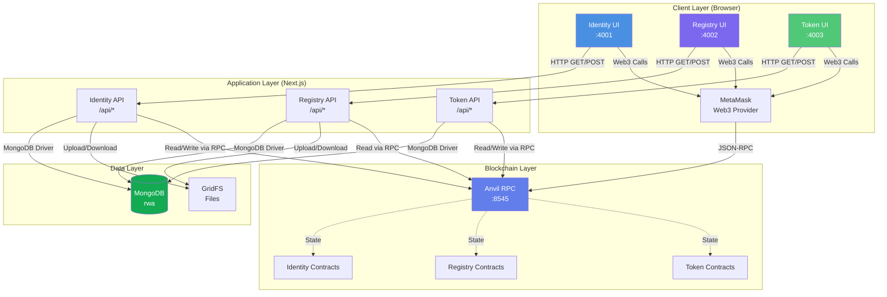

---

## 📱 Diagrama de Interfaces de Usuario

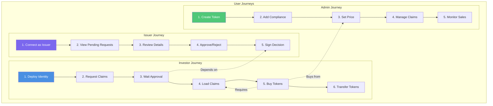

---

## 🔍 Diagrama de Verificación: Claim Validation

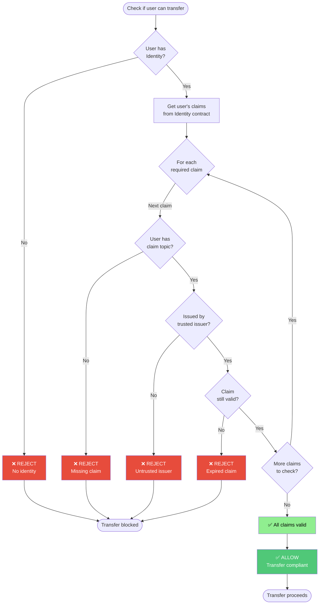

---

## 📋 Resumen de Diagramas

| Diagrama | Tipo | Descripción |
|----------|------|-------------|
| **System Context** | C4 Level 1 | Vista general del sistema y sus usuarios |
| **Container Diagram** | C4 Level 2 | Aplicaciones y cómo se comunican |
| **Component Diagram** | C4 Level 3 | Componentes internos de cada app |
| **Smart Contracts** | Integration | Cómo interactúan los contratos |
| **MongoDB Collections** | Data | Estructura de la base de datos |
| **Claim Lifecycle** | State | Estados de una solicitud de claim |
| **Purchase Flow** | Flow | Proceso de compra de token |
| **Deployment** | Infrastructure | Arquitectura de despliegue |
| **Security** | Sequence | Sistema de firmas digitales |
| **Entity Relationship** | Data | Relaciones entre colecciones |
| **Compliance Check** | Flow | Verificación de compliance |
| **Claim Validation** | Flow | Validación de claims |
| **User Journeys** | Flow | Recorridos de usuarios |

---

## 🎨 Leyenda de Colores

- 🔵 **Azul** (#4A90E2): Identity app / Identidad
- 🟣 **Púrpura** (#7B68EE): Registry app / Issuers
- 🟢 **Verde** (#50C878): Token app / Marketplace
- 🟡 **Amarillo** (#FFD700): Compliance / Módulos
- 🔴 **Rojo** (#E74C3C): Errores / Rechazos
- ⚪ **Gris** (#95A5A6): Infraestructura

---

## 📖 Cómo Leer los Diagramas

### Símbolos Comunes

- `[Rectángulo]`: Componente/Sistema
- `{Diamante}`: Decisión/Condición
- `(Círculo)`: Inicio/Fin
- `-->`: Flujo de datos/control
- `-.->`: Relación/Dependencia
- `===>`: Flujo principal destacado

### Notación Mermaid

Todos los diagramas usan **Mermaid**, compatible con:
- GitHub Markdown
- GitLab
- Visual Studio Code (con extensión)
- Notion
- Obsidian

### Renderizar Localmente

```bash
# Opción 1: VS Code
# Instalar extensión "Markdown Preview Mermaid Support"

# Opción 2: Online
# https://mermaid.live/

# Opción 3: CLI
npm install -g @mermaid-js/mermaid-cli
mmdc -i DIAGRAMA_C4.md -o diagrams.pdf
```

---

## 🎓 Uso Educativo

### Para Presentaciones

1. Abrir este archivo en VS Code con Mermaid extension
2. Exportar cada diagrama como imagen (PNG/SVG)
3. Usar en slides de PowerPoint/Google Slides

### Para Estudio

1. Seguir los diagramas de flujo paso a paso
2. Comparar con el código real en cada app
3. Ejecutar el sistema y verificar cada paso

### Para Desarrollo

1. Usar diagramas como referencia de arquitectura
2. Entender dependencias antes de modificar código
3. Documentar nuevos features con diagramas similares

---

**Versión:** 2.0.0  
**Fecha:** 11 de Noviembre, 2024  
**Formato:** Mermaid Diagrams  

🎨 **Diagramas completos de la arquitectura RWA!**

